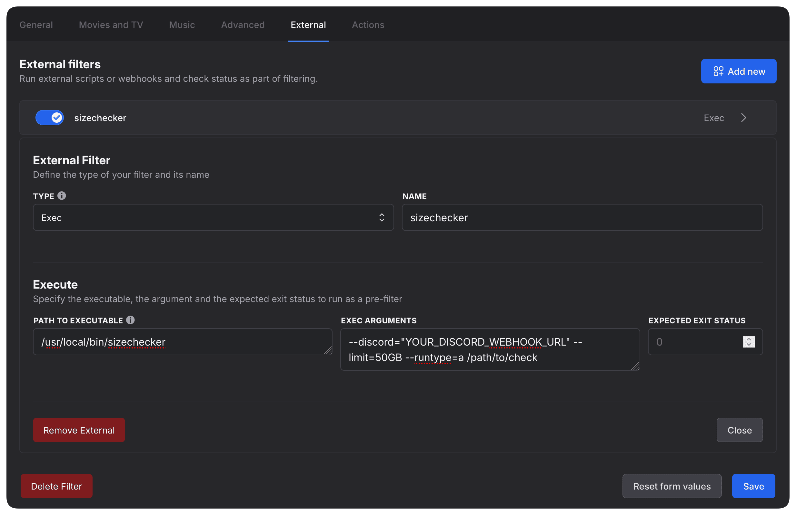

**Sizechecker** is a companion tool for **autobrr** that helps prevent accepting new downloads when certain disk space conditions are met. It can check both used and available disk space and can send notifications to a Discord webhook if the specified threshold is crossed.

## Step 1: Grab the Binary

1. Open your terminal.

2. Run the following command to download the appropriate binary for your Linux system:

For **Linux (AMD64)**:

```bash
wget $(curl -s https://api.github.com/repos/s0up4200/sizechecker/releases/latest | grep download | grep linux_amd64 | cut -d\" -f4)
```

For **Linux (ARM64)**:

```bash
wget $(curl -s https://api.github.com/repos/s0up4200/sizechecker/releases/latest | grep download | grep linux_arm64 | cut -d\" -f4)
```

3. Extract the downloaded tar.gz file:

```bash
tar -xzf sizechecker_1.0.0*.tar.gz
```

4. Once extracted, make the binary executable:

```bash
chmod +x sizechecker
```

5. (Optional) Move the binary to a directory in your `PATH` to make it globally accessible:

```bash
sudo mv sizechecker /usr/local/bin/
```

### Step 2: Usage Examples

#### 1. Check Available Disk Space and Notify via Discord Webhook

The basic usage of the tool is to check the available disk space on a specified directory and optionally send a Discord notification if the available space is below a certain threshold.

**Example:**

```bash
sizechecker --limit=50GB --runtype=a --discord="YOUR_DISCORD_WEBHOOK_URL" /path/to/check
```

- `--limit=50GB`: This sets the **minimum required free space** in the specified directory.
- `--runtype=a`: This tells the tool to check for **available** disk space.
- `--discord`: This is the Discord webhook URL where the notification will be sent if the disk space is below the specified limit.
- `/path/to/check`: This is the directory where you want to check available space. E.g., `~/` for your home directory.

#### 2. Check Used Disk Space and Notify via Discord Webhook

You can also use the tool to check the used disk space in a specified directory, and send a notification if the used space exceeds a certain limit.

**Example:**

```bash
sizechecker --limit=500GB --runtype=u --discord="YOUR_DISCORD_WEBHOOK_URL" /path/to/check
```

- `--limit=500GB`: This sets the **maximum allowed used space** in the specified directory.
- `--runtype=u`: This tells the tool to check for **used** disk space.
- `--discord`: Discord webhook URL for notifications.
- `/path/to/check`: The directory to check.

#### 3. Set a Cooldown to Avoid Frequent Notifications

You can specify a cooldown period between notifications to prevent the tool from sending too many messages to Discord in a short time. By default, the cooldown is set to 1 minute if not specified.

**Example:**

```bash
sizechecker --discord="YOUR_DISCORD_WEBHOOK_URL" --cooldown=5m --limit=50GB --runtype=a /path/to/check
```

- `--cooldown=5m`: This sets a cooldown period of 5 minutes between notifications. If the disk space check fails within the cooldown period, no additional notification will be sent.

### Step 3: Setup in autobrr

1. Inside an **autobrr filter**, go to the **External** tab.

2. Click **Add New**.

3. Choose **Type: Exec**.

4. **Name**: Give it a name like `sizechecker`.

5. **Path**: To find the full path of the `sizechecker` binary, you can use the following command:

   ```bash
   which sizechecker
   ```

   Copy the output and paste it into the **Path** field.

6. **Exec Arguments**: Add the required arguments. For example, to check for at least 50GB free space in `/path/to/check`, add the following:

   ```bash
   --discord="YOUR_DISCORD_WEBHOOK_URL" --limit=50GB --runtype=a /path/to/check
   ```

7. **Expected Exit Status**: Set the expected exit status to `0`.



**Additional Information:**

- The `--runtype` flag accepts two values:
  - `a`: Check for **available** free space. The tool will warn if the available space is **less than** the specified limit.
  - `u`: Check for **used** disk space. The tool will warn if the used space is **greater than** the specified limit.

- The `--limit` flag works differently based on the `--runtype`:
  - For `runtype=a`, `--limit` specifies the **minimum required free space**.
  - For `runtype=u`, `--limit` specifies the **maximum allowed used space**.
