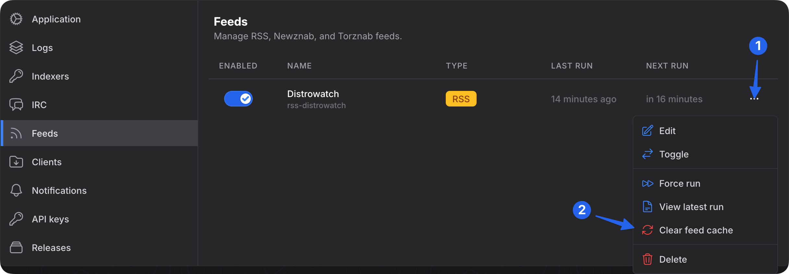

Some indexers does not have an IRC announce channel.
Luckily, most of them have RSS support.  
You will treat Torznab/Newznab and RSS feeds as regular indexers when setting up your filters.

## Torznab / Newznab

Torznab and Newznab is essentially like browsing the torrents page, but automated and unified.

Prowlarr and Jackett are supported. We recommend that you use Prowlarr.

Go to `Settings > Indexers` and add `Generic Torznab` or `Generic Newznab` from the list.

- **Name**: `<name of indexer>`
- **Torznab/Newznab URL**: `http://localhost:port/ID/api`
- **API Key**: `<API key>`
- **Download type**: `Torrent` or `Magnet`

Once saved, head over to `Settings > Feeds` to enable it.

autobrr will get the latest 25 items from the RSS feed. On first run it will check all and cache the entries, on the second run it will check for any new entries and run them through the assigned filters.

:::tip
The `ID` part of the URL is the number given to the indexer by Prowlarr.
You can see which number it is in Prowlarr by clicking the Indexer Name and viewing it in the info box.

The `/api` part of the URL is not to be confused with `<API key>` in the field below it.
:::

## RSS

Find the RSS feature of your indexer and grab the RSS link.

Go to `Settings > Indexers` and add `Generic RSS` from the list.

- **Name**: `<name of indexer>`
- **RSS URL**: `http://myindexer.com/rss`
- **Download type**: `Torrent` or `Magnet`

Once saved, head over to `Settings > Feeds` to enable it.

autobrr will get the latest items from the RSS feed. On first run it will check all and cache the entries, on the second run it will check for any new entries and run them through the assigned filters.

## Clearing the feed cache

Since version `1.29` it is possible to clear the feed cache.
Head to **Settings** -> **Feeds** and click the three dots for the feed you want to clear.

:::tip
The cache is cleaned automatically every 30 days.
:::
