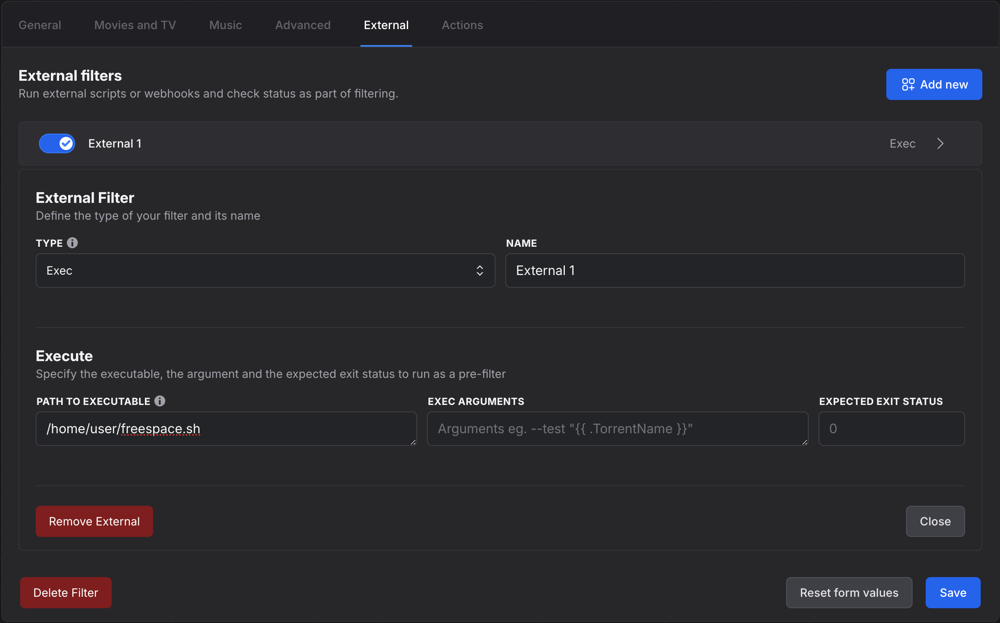

## Stop if disk is full

You can make autobrr stop adding torrents to your download client whenever you're running low on space.

:::info
To make this work without any extra steps, autobrr needs to run on the same server as the download client.
:::

### Create the script

```bash
touch ~/freespace.sh && chmod +x ~/freespace.sh
```

```bash
#!/bin/bash
set -e

reqSpace=100000000 # 100GB
SPACE=`df "$HOME/torrents" | awk 'END{print $4}'`
if [[ $SPACE -le reqSpace ]]
then
  #echo "not enough space"
  #echo "free $SPACE"
  exit 1
fi
#echo "got space"
#echo "free $SPACE"
exit 0
```

If the script sees that there is enough space available, it will return exit code 0 and autobrr will push the torrent to the download client.

If free space falls below your limit, the script will return exit code 1 and autobrr will skip it.

### Add it to your existing filter


