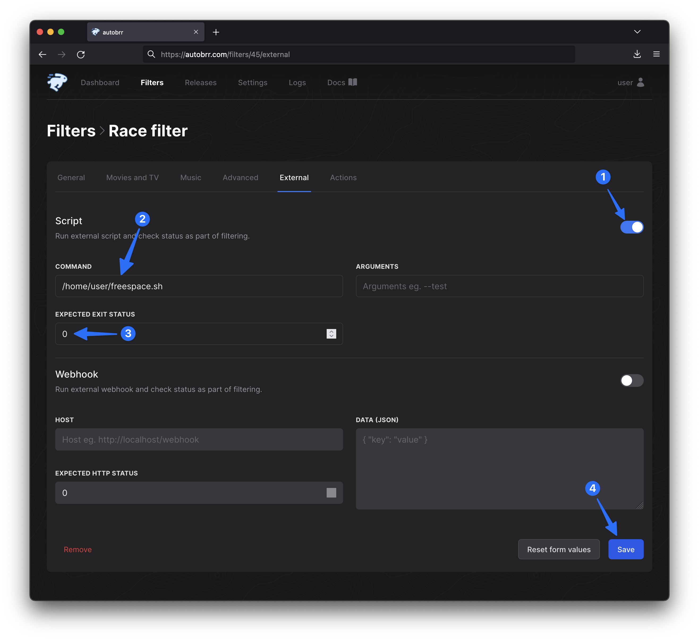

Want autobrr to stop adding torrents to your client when you're running low on space? No problem.

## Create the file

```bash
touch ~/freespace.sh && chmod +x ~/freespace.sh
```

```bash
#!/bin/bash
set -e

reqSpace=100000000 # 100GB
SPACE=`df "$HOME/torrents" | awk 'END{print $4}'`
if [[ $SPACE -le reqSpace ]]
then
  #echo "not enough space"
  #echo "free $SPACE"
  exit 1
fi
#echo "got space"
#echo "free $SPACE"
exit 0
```

## Add it to your existing filter



Expected exit status should be set to 0 which is predefined.
